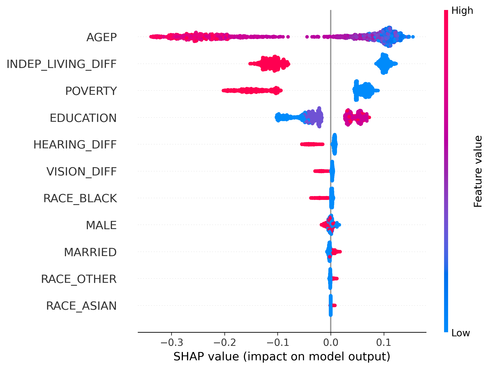
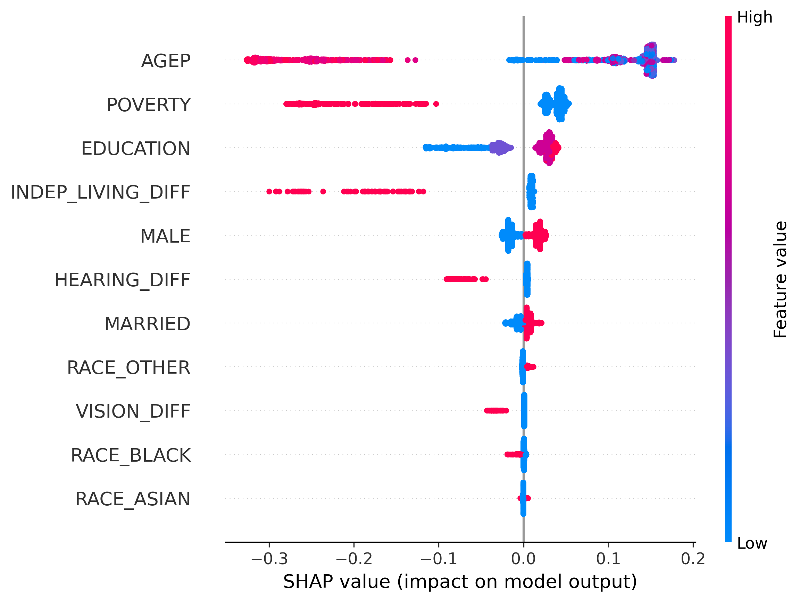

<h2 style="margin-bottom:0px;">
Comparing Predictors of Employment Among Adults With and Without Cognitive Difficulties in the United States:</h2>
<h3 style="margin-top:0px">
Using Random Forest and SHAP Analyses
</h3> 

<strong>Yesang Cho</strong>

### Project Repository
GitHub Repository: [Models Project](https://github.com/joyesang/project4_models)

## Introduction

Employment is an important component of adult life, providing not only financial resources but also opportunities for social participation, self-esteem, and a sense of purpose (Sundar et al., 2018). However, many jobs require workers to perform complex tasks involving memory, attention, problem-solving, decision-making, and executive functioning, making cognitive difficulties potential barriers to obtaining and maintaining employment. Previous studies have found that individuals with cognitive impairments are more likely to experience unemployment or reduced work participation (Appenzeller et al., 2009; Silvaggi et al., 2020). 

Population aging, longer working lives, and improved identification of cognitive impairments have increased the number of adults with cognitive limitations who remain active in the labor force (Silvaggi et al., 2020). Despite this growing population, relatively little research has examined which factors are most strongly associated with employment among adults with cognitive difficulties, particularly using modern machine learning approaches capable of identifying complex and non-linear relationships among predictors.

Therefore, the purpose of this study was to identify and compare predictors of employment among adults with and without cognitive difficulties in the United States using Random Forest and SHAP analyses. Using data from the 2024 American Community Survey (ACS), this study examined demographic, socioeconomic, and disability-related factors associated with employment. By comparing the importance of these predictors across groups, this study aims to provide a better understanding of the factors associated with employment and to inform policies and interventions designed to improve workforce participation among adults with cognitive difficulties.
 

## Methods

This study used data from the 2024 American Community Survey (ACS) Public Use Microdata Sample (PUMS), a nationally representative survey conducted by the U.S. Census Bureau. The sample was restricted to individuals aged 16 years and older. After removing cases with missing values and excluding individuals serving in the Armed Forces, the final sample included 2,859,516 respondents. Among them, 204,057 reported a cognitive difficulty and 2,655,459 did not.

Employment status was used as the outcome variable. Individuals who were employed were coded as 1, whereas unemployed individuals and those not in the labor force were coded as 0. Predictor variables included age, sex, educational attainment, marital status, race, poverty status, hearing difficulty, vision difficulty, and independent living difficulty.

Random Forest models were estimated separately for respondents with and without cognitive difficulties to identify factors associated with employment. Model performance was evaluated using training and testing accuracy. In addition, SHapley Additive exPlanations (SHAP) were used to examine the relative importance and direction of predictor effects.

## Results

### (1) Random Forest model

Random Forest models were estimated separately for respondents with and without cognitive difficulties. The model for respondents with cognitive difficulties achieved a training accuracy of 77.5% and a testing accuracy of 77.6%. For respondents without cognitive difficulties, the model achieved a training accuracy of 80.2% and a testing accuracy of 80.3%. The similarity between training and testing accuracies suggests that both models showed little evidence of overfitting.

<table>

<em><strong>Table 1</strong> Variable Importance among Respondents with Cognitive Difficulties</em>

<thead>
<tr>
<th colspan="2">Respondents with Cognitive Difficulties</th>
<th colspan="2">Respondents without Cognitive Difficulties</th>
</tr>
<tr>
<th>Variable</th>
<th>Importance</th>
<th>Variable</th>
<th>Importance</th>
</tr>
</thead>
<tbody>
<tr>
<td><strong>Age</td>
<td><strong>0.434</td>
<td><strong>Age</td>
<td><strong>0.629</td>
</tr>
<tr>
<td><strong>Independent Living Difficulty</td>
<td><strong>0.259</td>
<td><strong>Poverty (< 100% FPL)</td>
<td><strong>0.186</td>
</tr>
<tr>
<td><strong>Poverty (< 100% FPL)</td>
<td><strong>0.181</td>
<td>Educational Attainment</td>
<td>0.065</td>
</tr>
<tr>
<td>Educational Attainment</td>
<td>0.085</td>
<td>Independent Living Difficulty</td>
<td>0.063</td>
</tr>
<tr>
<td>Hearing Difficulties</td>
<td>0.022</td>
<td>Hearing Difficulties</td>
<td>0.027</td>
</tr>
<tr>
<td>Vision Difficulties</td>
<td>0.006</td>
<td>Sex</td>
<td>0.014</td>
</tr>
<tr>
<td>Sex</td>
<td>0.005</td>
<td>Married</td>
<td>0.008</td>
</tr>
<tr>
<td>Married</td>
<td>0.004</td>
<td>Vision Difficulties</td>
<td>0.004</td>
</tr>
<tr>
<td>Black (ref. White)</td>
<td>0.003</td>
<td>Other (ref. White)</td>
<td>0.002</td>
</tr>
<tr>
<td>Other (ref. White)</td>
<td>0.001</td>
<td>Black (ref. White)</td>
<td>0.001</td>
</tr>
<tr>
<td>Asian (ref. White)</td>
<td>0.000</td>
<td>Asian (ref. White)</td>
<td>0.000</td>
</tr>
</tbody>
</table>

Table 1 illustrates the difference in variable importances between the two groups. Among respondents with cognitive difficulties, age was the most important predictor of employment, followed by independent living difficulty, poverty status, and educational attainment. In contrast, among respondents without cognitive difficulties, age remained the most important predictor, but poverty status and educational attainment were more influential than independent living difficulty. Notably, independent living difficulty showed substantially greater importance among respondents with cognitive difficulties than among those without cognitive difficulties.
 

### (2) SHapley Additive exPlanations (SHAP)

Figure 1 and Figure 2 present SHAP summary plots for respondents with and without cognitive difficulties, respectively. Across both groups, age, poverty status, educational attainment, and independent living difficulty were the most influential predictors of employment.

    
    
<em><strong>Figure 1</strong> SHAP Analysis among Respondents with Cognitive Difficulties</em>

 

    
    
<em><strong>Figure 2</strong> SHAP Analysis among Respondents without Cognitive Difficulties</em>

 

The SHAP analyses also revealed notable differences between the two groups. Among respondents with cognitive difficulties (Figure 1), independent living difficulty was one of the strongest predictors of employment. Individuals with independent living difficulties were substantially less likely to be employed than those without such difficulties. In contrast, independent living difficulty played a smaller role among respondents without cognitive difficulties (Figure 2).

 

## Discussions 

This study found that age, poverty status, educational attainment, and independent living difficulty were important predictors of employment among adults with and without cognitive difficulties. Younger age, higher educational attainment, and the absence of poverty were associated with a greater likelihood of employment.

One of the most notable findings was the importance of independent living difficulty among adults with cognitive difficulties. Both the Random Forest and SHAP analyses indicated that independent living difficulty was substantially more influential among respondents with cognitive difficulties than among those without cognitive difficulties. This finding suggests that functional independence may play a particularly important role in employment outcomes for individuals with cognitive difficulties. 

Several limitations should be considered when interpreting these findings. First, the study relied on cross-sectional data from the 2024 ACS, which prevents conclusions about causal relationships between predictors and employment outcomes. Second, cognitive difficulty was measured using a single ACS survey item rather than a clinical assessment, which may not fully capture the complexity or severity of cognitive impairments. 

Despite these limitations, the findings suggest that interventions aimed at improving independent living skills may contribute to better employment outcomes among people with cognitive difficulties. Future research should explore additional factors associated with employment and examine whether similar patterns are observed using longitudinal data.

### References

Appenzeller, S., Cendes, F., & Costallat, L. T. (2009). Cognitive impairment and employment status in systemic lupus erythematosus: a prospective longitudinal study. Arthritis Care & Research: Official Journal of the American College of Rheumatology, 61(5), 680-687.

Silvaggi, F., Leonardi, M., Tiraboschi, P., Muscio, C., Toppo, C., & Raggi, A. (2020). Keeping people with dementia or mild cognitive impairment in employment: a literature review on its determinants. International journal of environmental research and public health, 17(3), 842.

Sundar, V., O’Neill, J., Houtenville, A. J., Phillips, K. G., Keirns, T., Smith, A., & Katz, E. E. (2018). Striving to work and overcoming barriers: Employment strategies and successes of people with disabilities. Journal of Vocational Rehabilitation, 48(1), 93-109.
